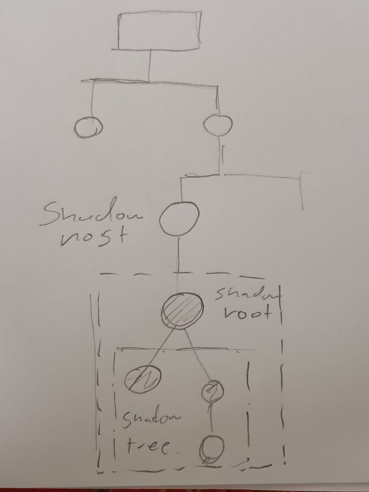

## Shadow DOM

Its an encapsulated DOM region of the DOM

## Parts

* Shadow host: The Regular Node of the DOM to which is attached the DOM

* Shadow tree : The DOM tree inside shadow DOM.
* Shadow root: The root node of the Shadow tree

The shadowDOM can be accesssed through JS.
